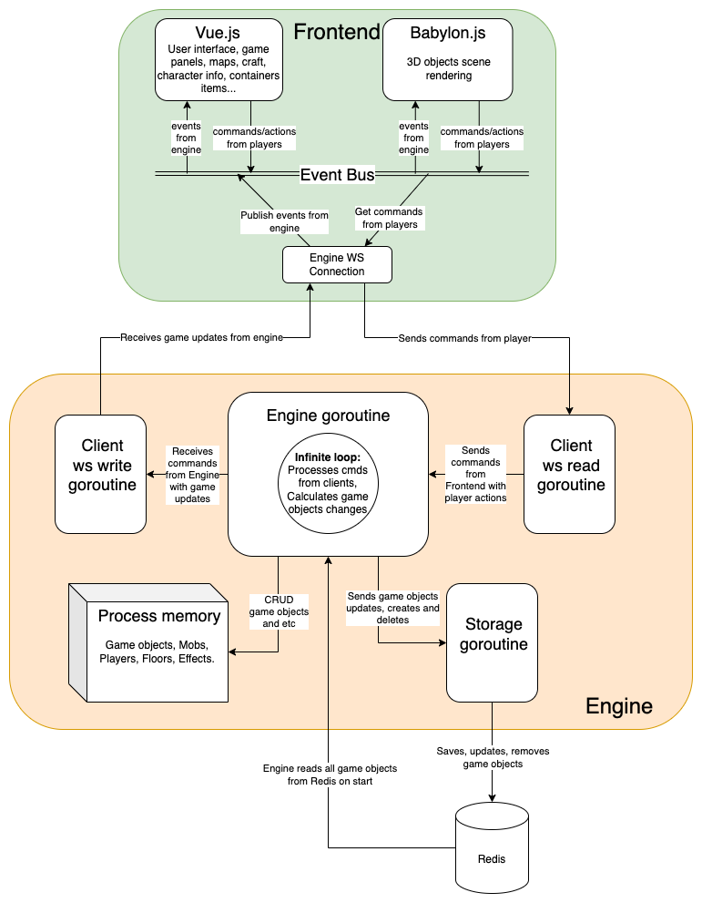

# Reborn MMO RPG Docs

## General information
The project consist of the following main services (you can see them in [docker-compose.yml](../docker-compose.yml) file):
- `api` - [Sinatra](https://sinatrarb.com/) based API for user registration and basic character creation. 
- `engine` - [golang](https://go.dev/) based game engine, which performs all game world calculations and talks with frontend via web sockets.
- `frontend` - [Vue.js](https://vuejs.org/) and [Babylon.js](https://babylonjs.com/) based frontend, which performs HTTP requests to `api` and establishes web sockets communication with `engine`.
- `db` - [PostgreSQL](https://www.postgresql.org/) database to store users. Used by `api`.
- `redis` - [Redis](https://redis.io/) is used to store game objects, so they could survive `engine` restart.
- `chat` - used to implement simple chat between players. Communicates with `frontend` via web sockets.
- `engine_api` - used to provide HTTP API for `engine` in RARE cases it is needed (display image with floor map).
- `caddy` - web gateway.

## Frontend <-> Engine Architecture

## List of commands from Frontend (Players) to Engine
See [engine/pkg/game/engine/process_command.go](../engine/pkg/game/engine/process_command.go)

## List of game updates from Engine to Frontend
- `init_game` - sends a bunch of `add_object` commands when player loads a page with the game.
- `add_object` - instructs frontend to add new game object.
- `add_objects` - same as above, but for multiple objects. Used for better performance in case we need to add many objects.
- `remove_object` - instructs frontend to remove game object.
- `remove_objects` - same as above, but for multiple objects. Used for better performance in case we need to remove many objects.
- `update_object` - instructs frontend to update game object (health, location, etc).
- `add_message` - adds message to chat window. Used to send text explanations of events and errors.
- `character_info` - information about character (equipped items).
- `equip_item` - equip item.
- `unequip_item` - unequip item.
- `pickup_object` - used to inform frontend that character picked up item.
- `npc_trade_info` - information about NPC sell/buy items.
- `craft_atlas` - information about possible craft items.
- `container_items` - list of items in ncontainer.
- `put_item_to_container` - instructs frontend to put item to container.
- `remove_item_from_container` - instructs frontend to remove item to container.
- `select_target` - instrcuts frontend to show that character selected Mob/other character as target.
- `deselect_target` - instrcuts frontend to show that character deselected Mob/other character as target.
- `melee_hit_attempt` - used to inform frontend that there was an attempt of melee hit.
- `start_delayed_action` - used to inform frontend that some time based action has started (like craft).
- `finish_delayed_action` - used to inform frontend that some time based action has finished (like craft).
- `cancel_delayed_action` - used to inform frontend that some time based action was cancelled (like craft).

## Game Object (GO) Architecture Design
*TODO*
- what is game object?
- atlases
- properties
- mobs
- effects
- lifecycle add/update/remove

## Floor Architecture design
You can think of Floor as some square or rectangle area, where characters can move. It could be an island, a dungeoun, a cave, etc.

Here are the key points:
- Engine stores an array of Floors (maybe later a map will be used).
- Each Game Object (GO) is placed inside one of the Floors.
- Floors are usually covered with surface GO of 1x1 size (grass, sand, water, etc).
- Floors are used to optimize collision detection calculations. For example: a character cannot move trhough the wall or tree. *PS: collisions are calculated only for GO, which have `collidable` attribute*
- Floors use special structure to store GOs called [QuadTree](https://jimkang.com/quadtreevis/). This allows to minimize the ammount of objects to detec collision with.
- Quadtree is also extensively used to detect, what a character can see by finding collisions between player vision area GO and other GOs.

## Player
*TODO*
- player_id
- vision area

## Main Engine Functions
Engine instance is passed via interface to almost every function in the game so you could easily create GOs and send different updates to `frontend` from anywhere.

To choose, which send fucntion to use, you should decide:
- who should see the update?
Only one player -> use `SendResponse`. For example: player requested to trade with NPC.
All players -> use `SendResponseToVisionAreas`. For example: player killed a mob.
- what happened? If GO changed -> use `SendGameObjectUpdate`. Everything else -> `SendResponse` or `SendResponseToVisionAreas`

See [engine.go](../engine/pkg/game/engine.go) file comments for more details.

## Melee Hit collision detection
*TODO*
